<h1 align="center">OneBlood</h1>

<h3 align="center">Repository for Blood Bank Portal.</h3>

## Screenshots

#### Home Page:

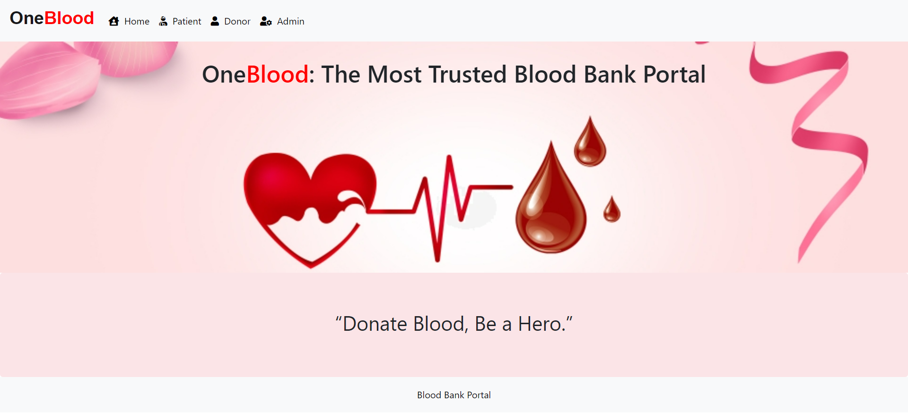

<!--  -->

<h4 align="center"><strong>Admin</strong></h4>

#### Dashboard

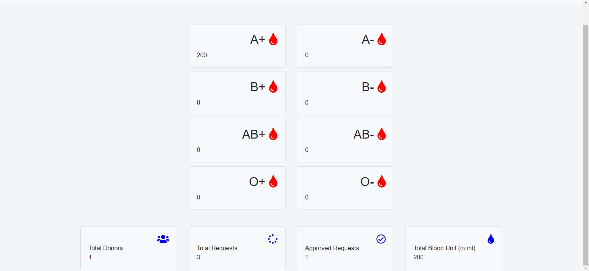

#### Admin Login Page

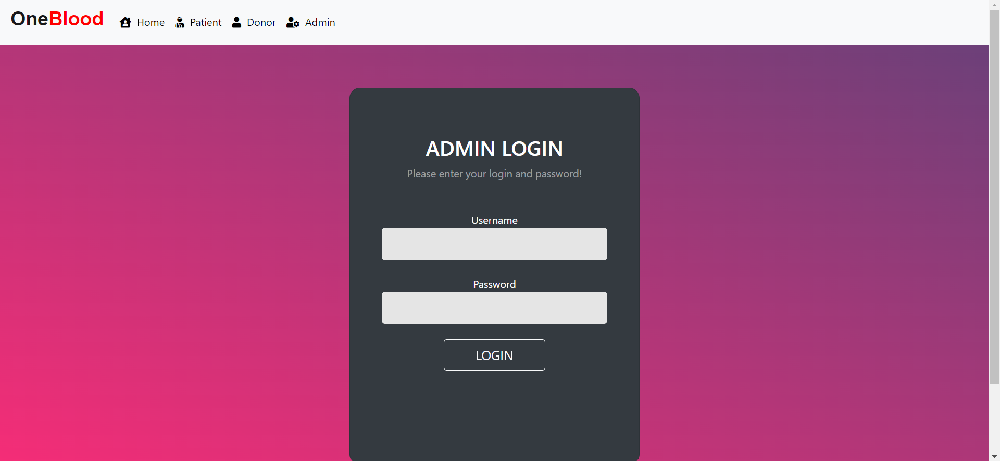

#### Blood Stock Page

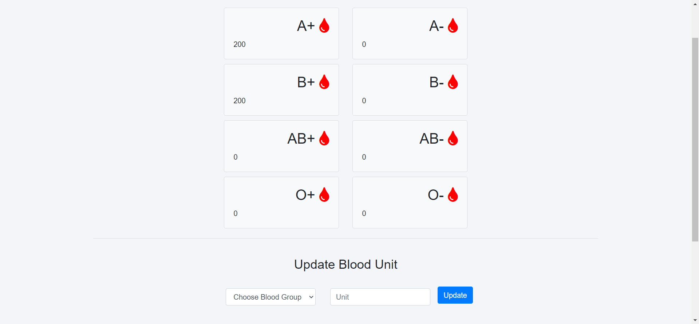

#### Blood Request Page

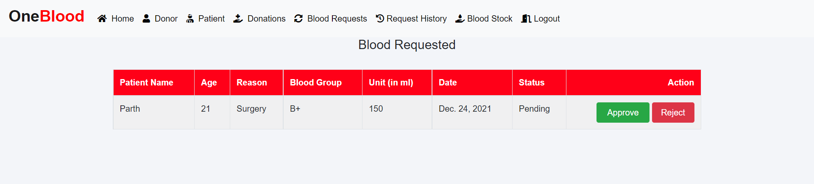

#### Blood Request History Page

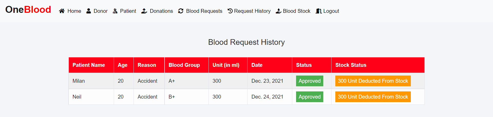

#### Donations Page

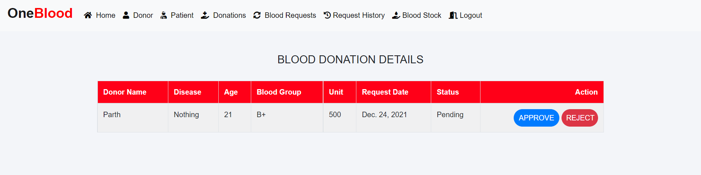

#### Donor Page

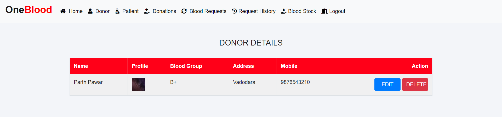

#### Patient Page

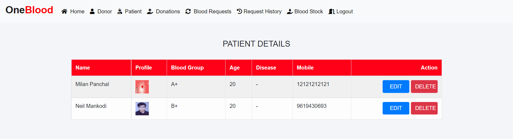

<!--  -->

<h4 align="center"><strong>Donor</strong></h4>

#### Dashboard

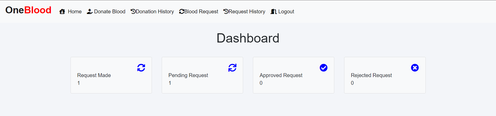

#### Donor Signup Page

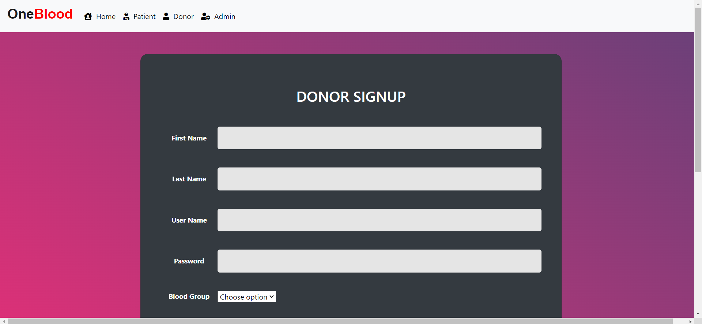

#### Donor Login Page

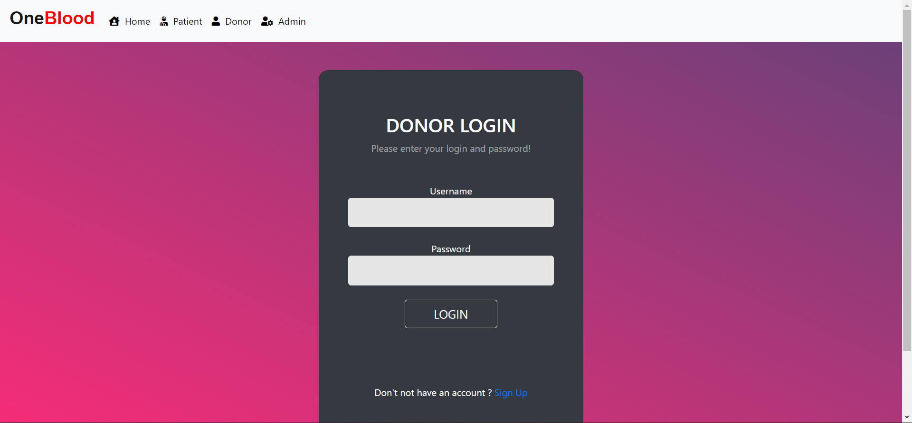

#### Blood Request Page

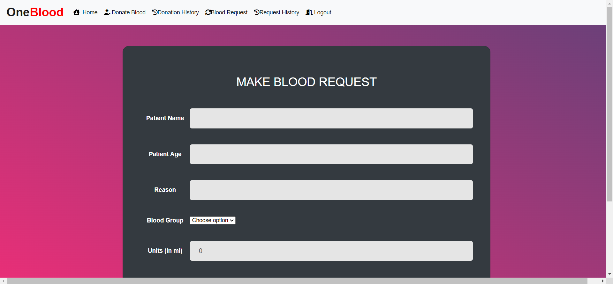

#### Blood Request History Page

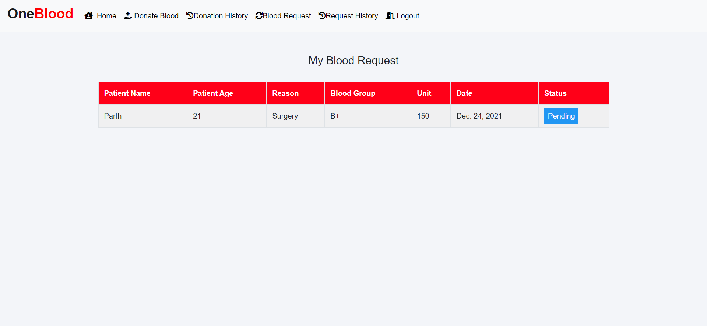

#### Donate Blood Page

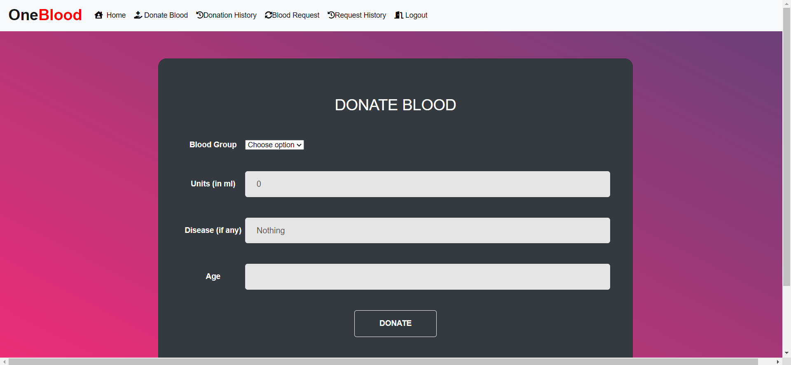

#### Donor History Page

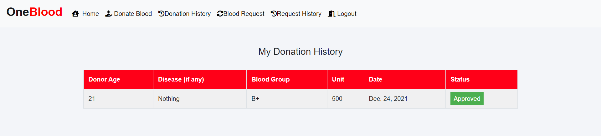

<!--  -->

<h4 align="center"><strong>Patient</strong></h4>

#### Dashboard

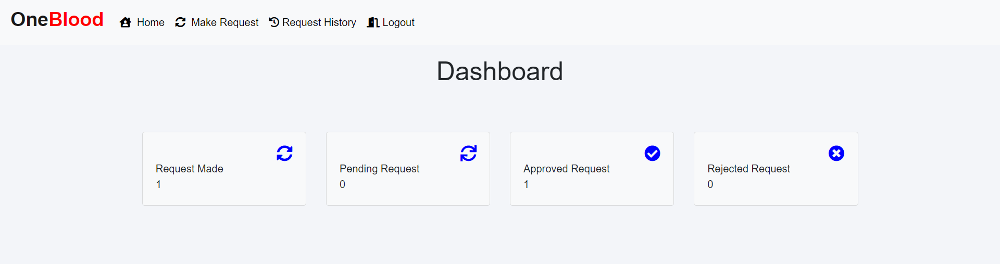

#### Signup Page

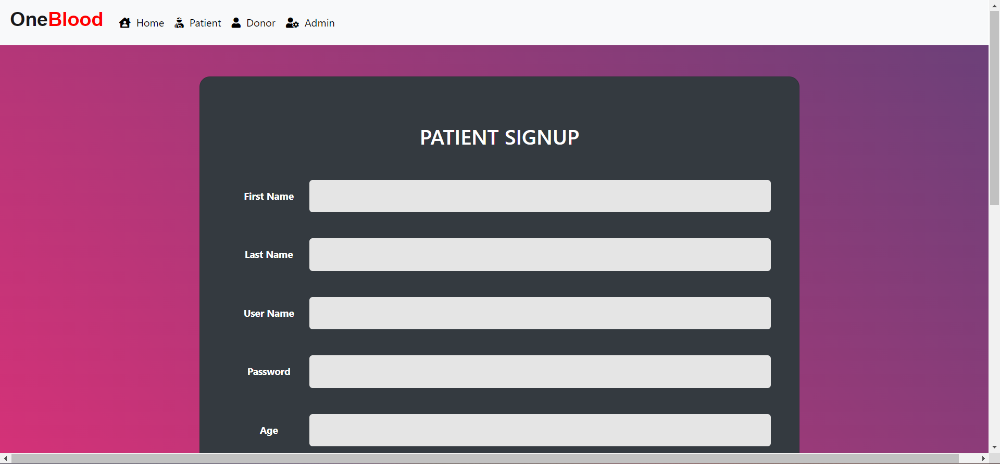

#### Login Page

#### Make Request Page

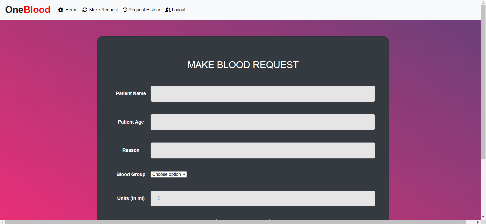

#### Request History Page

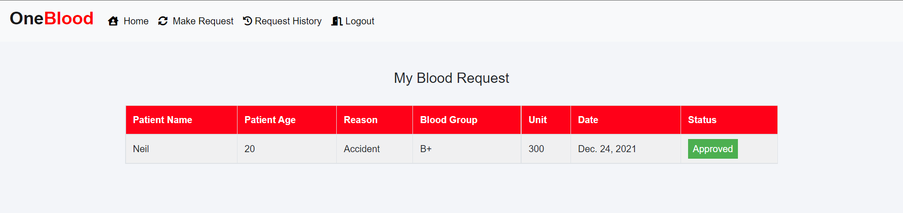

<!--  -->

#### Logout Page:

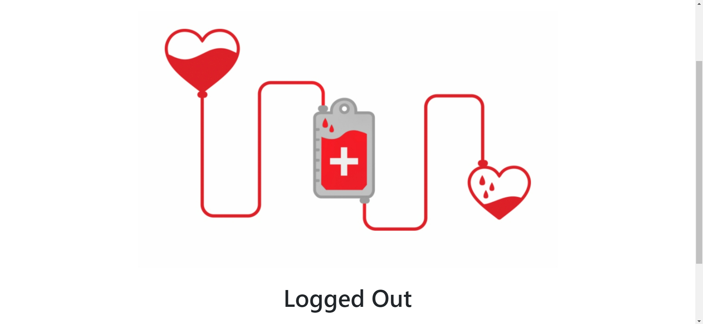
